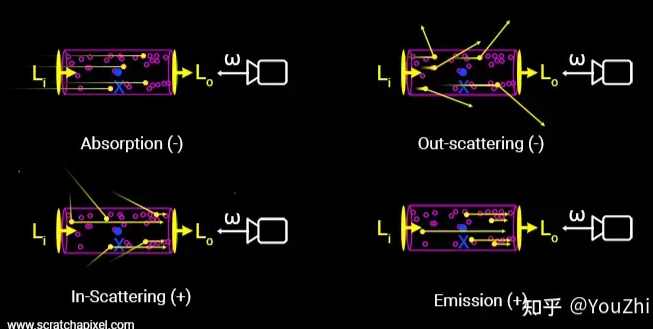
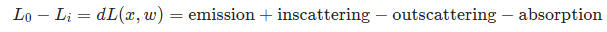

## 关于Nerf的学习笔记

### Nerf是什么？
Nerf-Neural Radiance Field（神经辐射场）算法

论文官网：https://www.matthewtancik.com/nerf

关于Nerf的一篇写的不错的文章：https://blog.csdn.net/qq_45752541/article/details/130072505

关于Nerf的网课讲解：https://www.bilibili.com/video/BV1CC411V7oq/?spm_id_from=333.337.search-card.all.click&vd_source=54ff782f01c0acb887b28fe22f172d2a

Nerf的定义：用一个MLP神经网络模型，去隐式地学习一个3D场景，最后输出能渲染出复杂环境的不同角度的视角图片。
---
### 隐式和显式的定义：  
显式存储3D信息：有明确位置信息（x,y,z坐标）（mesh、voxel、点云）  
隐式存储3D信息：无明确的xyz值，只能输出指定角度的2D图片

**在Nerf中，隐式存储表示为f( x , d ) → (density σ, color c)**

---
### MLP神经网络：
多层感知机（MLP），也叫人工神经网络（ANN，Article Neural Network），除了输入输出层，中间可存在多层隐式连接层，最简单的ANN/MLP至少拥有三层网络结构。

MLP网络结构是全连接的，也就是相邻层的每个节点都相互连接。

结构图：

---
### 模型输入输出结构：

输入：5维向量(x,y,z,theta,phi);   
输出：4维向量（密度，颜色（R,G,B））;   
模型：8层MLP

---
### 体渲染：   
* 引入体渲染的目的：   
Nerf将物体看作一团会发光的粒子，因此模型输入的是每个粒子的位姿   

* 体渲染：
计算光线时，将光线与物体老子的作用分为四类：   
吸收：光线经过粒子时，被粒子吸收，入射光强度减弱   
放射：光线经过粒子时，粒子本身可能发光，增强入射光强度   
外散射：光线直线传播，撞到粒子之后方向偏移，减弱入射光强度   
内散射：其他角度光线撞到粒子后方向修正，增强入射光强度   

   

于是出射光与入射光之间的变化量，可以表示为这四个过程的叠加：
  

体渲染公式推导: https://yindaheng98.github.io/%E5%9B%BE%E5%BD%A2%E5%AD%A6/%E4%BD%93%E6%B8%B2%E6%9F%93.html#%E5%90%91nerf%E9%9D%A0%E6%8B%A2%EF%BC%9Anerf%E4%B8%AD%E7%9A%84%E7%A6%BB%E6%95%A3%E5%8C%96%E4%BD%93%E6%B8%B2%E6%9F%93%E8%AE%A1%E7%AE%97%E5%85%AC%E5%BC%8F

### 输入
1. 如何从图片得到粒子？   
首先从图片和相机位姿选择1024个方向，得到1024条射线    
其次每个射线选择t在[2,6]范围上均匀分布的64个点   

2. 如何输入粒子？   
首先每个图片选择1024个像素    
每个像素得到一个对应方向的射线    
每个射线选择均匀分布的64个点    
每个点集以batch的形式输入MLP模型   
即每次输入1024*64个粒子，每个粒子维度是3维（代表方向）

3. 对应来说，输出也就是这些对应粒子的密度和颜色